<picture>
  <source media="(prefers-color-scheme: dark)" srcset="./dark.svg">
  <source media="(prefers-color-scheme: light)" srcset="./light.svg">
  
</picture>

## À propos

Étudiante en **Master 1 Intelligence Artificielle** à l'Université de Ghardaïa (Algérie), après une Licence en Systèmes Informatiques (mention Excellence, 2023–2026).

Je m'intéresse au Machine Learning et au Deep Learning, et je reconstruis mon portfolio avec des projets documentés de A à Z.

## Expérience

**Développeuse backend — SolidLink** (Icosium, Alger · déc. 2025 – mai 2026)
Backend d'une marketplace B2B (NestJS, TypeScript, PostgreSQL), réalisé en projet de fin d'études.

## Formation complémentaire

- Supervised Machine Learning : Regression and Classification — Andrew Ng, DeepLearning.AI (2025)

## Contact

[GitHub](https://github.com/safaamini)
